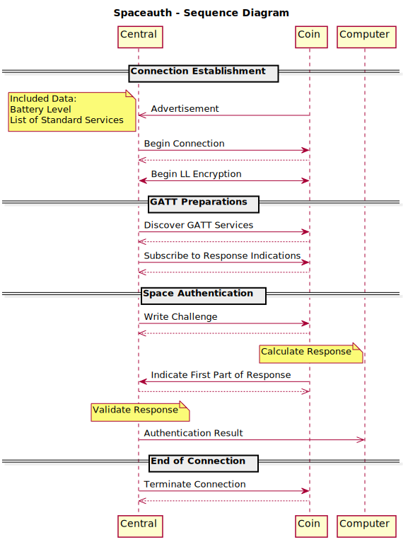

# BLE Keyfob Authentication (PROJECT STATUS: DEPLOYED)
The purpose of this project is to provide members of the [NETZ39 Hackerspace](http://www.netz39.de/) a new, (sufficiently) secure and easy-to-use way to unlock the door of the Hackerspace.

## Principle Structure
This project uses Bluetooth Low Energy 5 as a wireless transport. An [**authenticated**, **encrypted**](https://en.wikipedia.org/wiki/CCM_mode) and [**private**](https://www.bluetooth.com/blog/bluetooth-technology-protecting-your-privacy/) connection is used with security mode 1 level 4. On top of BLE security, a simple [MAC based challenge-response authentication](https://crypto.stackexchange.com/questions/51931/hmac-based-challenge-response-authentication) using the [BLAKE2s hash function](https://blake2.net/) in MAC mode is used.

Components:
* A central (base station) with a NRF52480 chip, here a [**NRF52840 dongle**](https://www.nordicsemi.com/?sc_itemid=%7BCDCCA013-FE4C-4655-B20C-1557AB6568C9%7D)

* Peripherals (key fobs) using an NRF52832 chip, here a [**chinese board**](https://www.aliexpress.com/item/32954025507.html)

Both types of devices use the [Zephyr OS with integrated BLE stack](https://www.zephyrproject.org/).

**No real pairing** is done with devices in this project.
Pairing and bonding is done at when flashing a coin. This step generates the BLE address and keys (IRK, LTK) and the key for application-layer security (SPACEKEY). There is a shell interface at the central to list, add and remove coins.

The central continuously scans for known devices. Upon connection, it immediately tries to turn on encryption and kills the connection if that fails.

The peripherals implement the following GATT services:

The spaceauth service expects a full BLAKE2s block (64B) of data to be sent to the challenge characteristic. Writing to this characteristic is protected and only available with a valid BLE bond.
After the challenge has been received, a response (32B) is generated. The first few bytes of the response (as much as fits one MTU) are then **indicated** to the central.

After that, the central knows it can download the response. The response is then checked with the locally generated response with **constant time comparison**.

The peripherals shut down when a connection to them is cancelled. They start up again when the button is pressed.
Both peripherals and the central kill the connection after a short timeout (5s).

## Building locally (on Linux)
1. Follow the [installation instructions](https://github.com/zephyrproject-rtos/zephyr/blob/master/doc/getting_started/installation_linux.rst) and install the Zephyr SDK (0.10.3) at the standard location (`/opt/zephyr-sdk/`).
2. Go to the `prod/` folder and run the `./bootstrap.sh` script.
3. Run `make` to build the projects.

## Building via Docker
1. Make sure you also cloned the submodules of this repository.
2. Make sure `docker` is installed and your account is in the `docker` group.
3. Inside the repository folder, execute `docker run -i -t -u $UID -v $(pwd):/data/build maz3max/coinbuild` to build using the [build image](https://github.com/maz3max/ble-coin-docker).

## How to use?
1. Use the `gen_bond.py` script in the `prod/` folder to generate a `central.txt` and a `coins.txt` file. It will also generate a hex-file for the specific coin containing the keys (e.g. `coin_d33efc87ed2e.hex`). Every coin gets a line in `coins.txt`.
5. Flash `coin_[a-f0-9]{12}\.hex` onto the coin.
6. Flash `central.hex` onto the dongle. Connect to its USB Serial with Baudrate 115200 (on Linux, it is something like this`/dev/serial/by-id/usb-ZEPHYR_N39_BLE_KEYKEEPER_0.01-if00`)
7. Press enter to make sure you are in the shell
8. use the `central_setup` command with the contents of your `central.txt` to initialize the address and the IRK of the central.
9. use the `coin add` command with the last line of your `coins.txt` to add the newly compiled coin.
10. `reboot` if you like and run `ble_start` to start searching for devices.

## Basic Authentication Sequence

## Caveats
* Only **symmetrical** keys are used.
* The **authenticated pairing** part of the BLE security becomes obsolete because it only refers to pairing which is done via preprogramming here.
* Denial of Service cannot easily be cancelled out when using BLE.
* Like legacy-keys made out of metal, one of the BLE keys could be stolen and misused. (Authentication by ownership)
* Parts are not super-cheap: The central costs 10€ and one keyfob cost 5.50€
* These chinese boards seem to come with **fake** chips, whose **access port protection is broken**

## FAQ
* Why BLE?
    * the transport had to be wireless, low power and provide connection-level security
    * standardized and widespread technology allows to replace parts of the system easily
* Why Zephyr?
    * very active & helpful community
    * Open-Source BLE Stack
    * supports CMake
    * build system less annoying than Apache Mynewt
* Why not use the cheaper NRF51822?
    * AFAIK this chip does not have enough flash to support the Zephyr BLE stack with enabled security
    * The flash read back protection is broken: [step-by-step guide](https://www.pentestpartners.com/security-blog/nrf51822-code-readout-protection-bypass-a-how-to/)
* How do I get the software onto the devices?
    * For the NRF52840 dongle, you can use [nRF Connect for Desktop](https://www.nordicsemi.com/Software-and-Tools/Development-Tools/nRF-Connect-for-desktop)
    * For the coins, you have to use a Serial-Wire-Debug Programmer, but a [cheap 2€ STLinkV2 clone](https://de.aliexpress.com/item/32792513237.html) will do just fine using [OpenOCD](http://openocd.org/), See [coin readme](./coin/README.md)
* Can I use this project for my own purposes?
    * See LICENSE.md
